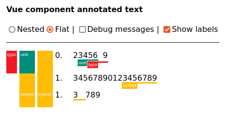
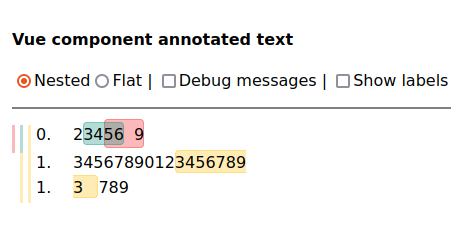

# Vue component annotated text

This repository contains a reusable Vue 2 / 3 component to visualize text annotations on web pages. It can be used for linguistic analysis, text structure or other annotations on unicode text. It is best explained by the following screenshots:






## Usage

The component uses typescript and is published on NPM as apackage with the original name [@ghentcdh/vue-component-annotated-text](https://www.npmjs.com/package/@ghentcdh/vue-component-annotated-text). 

To use the package in a project first add it to your dependencies with `npm` or `yarn` and import the component. It has typescript types for the structures it uses.

````
import {
  type Annotation,
  type Line,
  type AnnotationTarget,
  AnnotatedText
} from '@ghentcdh/vue-component-annotated-text'
import '@ghentcdh/vue-component-annotated-text/style.css'
````

Fill the annotations and textLines with the correct data - according to the Line and Annotation definitions - and choose a render style.

````
<template>
  <AnnotatedText
    text="012345678901234567890123456789"
    :annotations="annotations"
    :lines="textLines"
    :debug="true"
    :show-labels="false"
    render="nested"
    @click-annotation="onClick"
    @_mousemove="onMouseOver"
  />

</template>
````

Important: there is currently a severe limitation in the use of this component: **replacing the annotations property with a new array makes the annotations dissapear**. Emptying the same annotations array, e.g. by setting the length `annotations.length = 0`, and reusing it is the current workaround. It is unclear why this behaviour manifests itself.

## Documentation

For development: `yarn run dev`

To build the docs run `yarn run docs:build`

The docs end up in `docs/.vitepress/`


## Credits

Built @ the [Ghent Center For Digital Humanities](https://www.ghentcdh.ugent.be/), Ghent University by:

* Pieterjan De Potter
* Frederic Lamsens
* Joren Six
