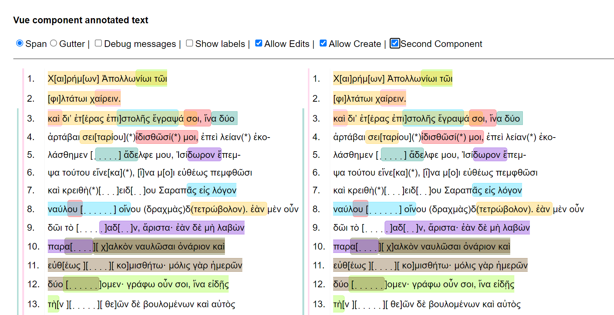

[](https://www.npmjs.com/package/@ghentcdh/annotated-text)
[](https://github.com/GhentCDH/annotated-text/actions/workflows/merge-request.yml)
[](https://github.com/GhentCDH/annotated-text/actions/workflows/publish.yml)
[](https://github.com/GhentCDH/annotated-text/actions/workflows/merge-request.yml)

# Component annotated text

This repository contains a reusable Javascript component to visualize text annotations on web pages. It can be used for
linguistic analysis, text structure or other annotations on unicode text. It is best explained by the following
screenshots:




Following text formats are supported:

- Plain text
- Text divided in lines
- Markdown text

  or Create your own text adapter

Following annotation formats are supported:

- W3C Web Annotation format
- Custom annotation format

  or Create your own annotation adapter

## Usage

## Documentation

To build the docs run `pnpm run docs:build` or access [Github Docs](https://ghentcdh.github.io/annotated-text)

## Creating a new release

Documentation on releases can be found
on: [Release documentation](https://ghentcdh.github.io/annotated-text/release/)

## Minimal working example

More Information in
the [Getting started documentation](https://ghentcdh.github.io/annotated-text/components/-getting-started/quikstart.html)

```scss
@use '@ghentcdh/annotated-text/style.css' as *;
```

````html

<div :id="id"></div>
````

```ts
import { createAnnotatedText } from "@ghentcdh/annotated-text";

const id = `annotated-text-{uuid}`;

const textAnnotation = createAnnotatedText(id)
  .setText(text)
  .setAnnotations(annotations);
```

## Credits

Built @ the [Ghent Center For Digital Humanities](https://www.ghentcdh.ugent.be/), Ghent University by:

* Pieterjan De Potter
* Frederic Lamsens
* Joren Six
* Jahid Chetti
* Bo Vandersteene

Development by [Ghent Centre for Digital Humanities - Ghent University](https://www.ghentcdh.ugent.be/). Funded by
the [GhentCDH research projects](https://www.ghentcdh.ugent.be/projects).


