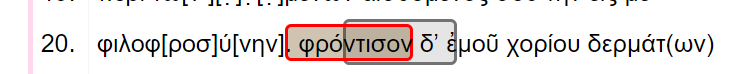

# Vue component annotated text

This repository contains a reusable Vue 3 component to visualize text annotations on web pages. It can be used for
linguistic analysis, text structure or other annotations on unicode text. It is best explained by the following
screenshots:




## Usage

## Documentation

To build the docs run `pnpm run docs:build`

### Slots

Every annotation has 2 named slots: annotation-start and annotation-end. One before the annotation, one after the
annotation.

Add following to your styles.scss

```scss
@use '@ghentcdh/vue-component-annotated-text/style.css' as *;
```

An example usage:

```vue

<AnnotatedText ...>
  <template #annotation-end="slotProps">
    <button>test</button>
  </template>
  <template #annotation-start="slotProps">
    <button>startTest</button>
  </template>
</AnnotatedText>
```

## Creating a new release

Documentation on releases can be found
on: [Release documentation](https://ghentcdh.github.io/vue_component_annotated_text/release/)

## Minimal working example

To get a minimal working example, create a new vue application `npm create vue@latest` and `cd` into the newly created
directory. Install the package with your favorite packet manager:  `npm i @ghentcdh/vue-component-annotated-text` and
modify `main.ts` to include an import the `css` and paste the following in `App.vue`. After starting with `npm run dev`
you should see some annotations.

````html
<!-- 
In main.ts add the following line to import css for the component:

import '@ghentcdh/vue-component-annotated-text/style.css'
-->

<script setup lang="ts">
  import {
    Line,
    Annotation,
    AnnotationTarget
  } from '@ghentcdh/vue-component-annotated-text';

  const lines = [
    { start: 0, end: 10, gutter: '1.', text: '0123456789' },
    { start: 11, end: 20, gutter: '2.', text: 'abcdefghij' },
    { start: 21, end: 30, gutter: '3.', text: 'klmnopqrst' },
    { start: 31, end: 40, gutter: '4.', text: 'uvwxyz1234' },
  ] as Line[];

  const annotations =[
    {
      id: '1',
      start: 1,
      end: 7,
      target: 'text',
    },
    {
      id: '2',
      start: 2,
      end: 9,
      target: 'text',
    },
  ] as Annotation[];
</script>

<template>˜
  <div>
    <AnnotatedText
      :lines="lines"
      :annotations="annotations"
    >
    </AnnotatedText>
  </div>
</template>
````

## Todo

- [ ] update tests
- [ ] update vitepress documentation

## Credits

Built @ the [Ghent Center For Digital Humanities](https://www.ghentcdh.ugent.be/), Ghent University by:

* Pieterjan De Potter
* Frederic Lamsens
* Joren Six
* Jahid Chetti
* Bo Vandersteene
